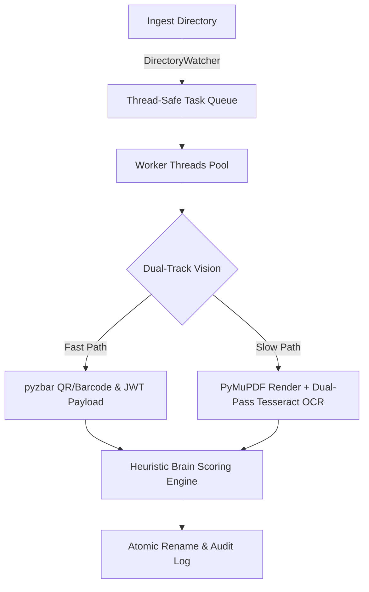

# OCR Document Logistics Engine (CROM)

A high-throughput, multi-threaded document recognition pipeline. This engine monitors a directory for incoming logistics PDFs (like invoices and delivery challans), uses computer vision to extract and identify the documents, and automatically routes and renames them based on strict regex heuristics.

### ⚙️ Core Architecture
* **Live Directory Watcher:** Real-time polling with queue management to handle bulk document dumps.
* **Multi-Threaded Workers:** Concurrent processing pool to handle heavy OCR rendering without UI blocking.
* **Hybrid Vision System:** 
  * Fast-path barcode/QR decoding (`pyzbar`) with JWT payload parsing.
  * Fallback OCR slow-path (`Tesseract`) with image preprocessing (sharpening, contrast, noise reduction via `Pillow`).
  * `PyMuPDF` (fitz) for PDF layout analysis and text layer extraction.
* **Rich TUI (Terminal UI):** Live telemetry dashboard built with `Rich`, tracking worker states, queue depth, win-rates, and recent history.

### The "Brain" (Heuristics Engine)
The engine doesn't just blindly read text; it scores it. It uses weighted regex patterns with negative lookbehinds to prevent false positives (e.g., rejecting 6-digit postal codes that look like tracking numbers).

*This repository contains the core engine logic. Proprietary vendor schemas and client routing rules have been sanitized for public portfolio display.*


# 📦 OCR Document Logistics Engine (CROM v10.3)

[](https://www.python.org/)
[](LICENSE)
[](https://github.com/tesseract-ocr/tesseract)
[](https://github.com/Textualize/rich)

An event-driven, multi-threaded computer vision pipeline and Terminal User Interface (TUI) designed to ingest, classify, extract, and rename high-volume logistics PDFs in real time.

---

### ⚠️ IMPORTANT: ARCHITECTURAL NOTICE
> **This engine is NOT a generic plug-and-play script.**  
> `crom.py` is an industrial-grade automation framework built around specific layout heuristics, QR formats, and document noise profiles. **It cannot be run out of the box on arbitrary PDFs without custom tailoring.** You must calibrate the configuration dictionary, regex rules, keyword weights, and false-positive boundaries to match your organization's exact document schemas.

---

## ⚡ Core Architecture



**Execution Flow:**  
`[ Ingest Directory ]` ➔ `[ DirectoryWatcher ]` ➔ `[ Task Queue ]` ➔ `[ Worker Pool ]` ➔ `[ Fast QR / Fallback OCR ]` ➔ `[ Brain Heuristics ]` ➔ `[ Atomic Rename ]`

---

## ✨ Key Capabilities

* **Dual-Track Vision Pipeline:** Evaluates high-speed QR/barcodes first via `pyzbar`. If unreadable or missing, gracefully falls back to multi-pass `Tesseract OCR` with contrast, sharpening, and median-filter preprocessing.
* **Non-Blocking Rich TUI:** Real-time terminal dashboard showing live thread activity, processing velocity, queue depth, historical win-rates, and system events.
* **Plausible Deniability & False-Positive Rejection:** Employs regex boundaries with negative lookbehinds and numeric blocklists to prevent postal codes, GSTINs, or telephone numbers from being misidentified as document IDs.
* **Atomic Filesystem Operations:** Relies on OS-level `os.replace` temp-file swapping to eliminate corruption risks during network drops, file-locking contention, or system interruptions.
* **Operational Runtime Modes:**
  * **Stitch Mode (`S`):** Merges sequential multi-page scan drops into a master PDF prior to parsing.
  * **Failsafe Mode (`F`):** Automatically appends unclassified pages to the previously verified document.
  * **Panic Stop (`I`):** Cancels in-flight worker threads immediately and safely pauses the queue.

---

## 📋 Prerequisites

### 1. External System Binaries
Tesseract OCR must be installed on your operating system:

* **Windows:** Install via the UB-Mannheim installer to `C:\Program Files\Tesseract-OCR\tesseract.exe`.

### 2. Python Dependencies
Install all required libraries via `pip`:
```bash
pip install pymupdf pillow pytesseract pyzbar rich
```

---

## 🛠️ Customization & Setup Guide

To adapt `crom.py` to your target workflow, adjust these three code blocks:

### 1. Global Parameters (`CONFIG`)
Modify global constants inside the `CONFIG` dictionary:
```python
CONFIG: AppConfig = {
    "WORKER_THREADS":       2,            # Number of parallel OCR threads
    "PREFERRED_PREFIX":     "img_",       # Only ingest files containing this prefix
    "WATCH_EXTENSIONS":     (".pdf",),    # Target extensions to monitor
    "INVOICE_PREFIX":       "INV-",       # Expected document identifier prefix
    "MIN_OCR_CONFIDENCE":   25.0,         # Minimum score required for auto-rename
}
```

### 2. Pattern Matching Rules (`_RAW_RULES`)
Define the document categories, priority ranks, and regex patterns to match:
```python
PatternRule(
    name="INVOICE",
    doc_type="INVOICE",
    priority=80,
    patterns=(
        r"(?i)\bINVOICE\s*(?:NO\.?)?\s*[:\-]?\s*(INV-\d{5,6})\b",
        r"(?<!\d)(INV-\d{5,6})(?!\d)",
    ),
    keywords=(
        "TAX INVOICE", "BILL TO", "ORIGINAL FOR RECIPIENT", "GSTIN",
    ),
)
```

### 3. Noise & Pincode Filter (`BrainSystem`)
Configure numeric ranges in `_PINCODE_RANGES` to ensure 6-digit postal codes or area codes are dropped rather than tagged as tracking numbers:
```python
_PINCODE_RANGES: Tuple[Tuple[int, int], ...] = (
    (100000, 100150),  # Region A
    (200000, 200500),  # Region B
)
```

---

## 🚀 Execution

Run the script from your terminal:
```bash
python crom.py
```

1. Select `[1] Watch mode`.
2. Select your target directory using the OS file dialog.
3. Drop PDF scans matching your `PREFERRED_PREFIX` into the folder and monitor extraction from the live dashboard.

---

## 🎮 Dashboard Controls

| Hotkey | Action | Function |
|:---:|---|---|
| **`P` / `Space`** | **Pause / Resume** | Halts directory polling and task assignment. |
| **`S`** | **Stitch Toggle** | Ingests multi-part pages and merges them into `Master.pdf`. |
| **`F`** | **Failsafe Toggle** | Blind-appends succeeding scans to the last processed document. |
| **`I`** | **Panic Stop** | Sets queue state to Paused and broadcasts an abort signal to workers. |
| **`Q`** | **Quit** | Shuts down worker threads cleanly and closes the application. |

---

## 📄 Audit Logging

All operations write persistent audit entries to `crom_audit.log` inside the monitored working directory:
```text
[2026-08-18 00:15:30] ID:INV-849201      TYPE:INVOICE      SIZE:420.5KB   METHOD:AUTO
[2026-08-18 00:16:02] ID:LR-102938       TYPE:LR           SIZE:1.1MB     METHOD:AUTO
```

---

## ⚖️ License
Distributed under the MIT License. See `LICENSE` for more information.
